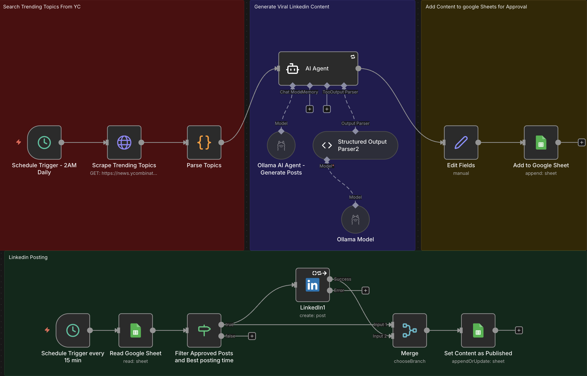

# 🚀 LinkedIn Content Automation System (self-hosted)

Automate your LinkedIn presence with AI-powered content generation. This n8n workflow scrapes trending topics from Hacker News, generates engaging LinkedIn posts using local AI, and publishes them automatically after your approval.

[](https://buymeacoffee.com/rihabrahali)
[](https://n8n.io)




## ✨ Features

- **🤖 AI-Powered Content Generation**: Uses Ollama with Llama 3.1 (you can change any model you need) to create professional LinkedIn posts
- **📈 Trend Detection**: Automatically scrapes Hacker News for trending tech topics
- **✅ Human-in-the-Loop**: Review and approve posts before publishing via Google Sheets
- **⏰ Smart Scheduling**: Daily content generation at 2 AM, publishing checks every 15 minutes
- **🎯 Tech-Focused**: Optimized for developers, CTOs, tech leaders, and engineers
- **🔄 Fully Automated Pipeline**: From topic discovery to LinkedIn posting

## 🎬 How It Works

### Content Generation Flow (Runs Daily at 2 AM)

```
Trigger (2 AM) → Scrape HN → Parse Topics → AI Analysis → Generate Post → Save to Sheet
```

1. **Scrape Trending Topics**: Fetches top 30 stories from Hacker News
2. **AI Content Creation**: Analyzes topics and generates engaging LinkedIn posts (200-300 words)
3. **Sheet Storage**: Saves drafts to Google Sheets with "pending" status

### Publishing Flow (Runs Every 15 Minutes)

```
Trigger (15 min) → Read Sheet → Filter Approved → Post to LinkedIn → Mark as Sent
```

1. **Check Approvals**: Reads Google Sheet for posts marked "yes"
2. **Auto-Publish**: Posts approved content to LinkedIn
3. **Update Status**: Marks published posts as "sent" in the sheet

## 📋 Prerequisites

Before you begin, ensure you have:

- **n8n instance** (self-hosted or cloud)
- **Ollama** installed locally with Llama 3.1 model
- **Google Account** for Sheets integration
- **LinkedIn Account** with API access
- **Google Sheet** set up with columns: `content`, `status`

## 🛠️ Installation

### Step 1: Install Ollama and Model

```bash
# Install Ollama (macOS/Linux)
curl -fsSL https://ollama.com/install.sh | sh

# Pull Llama 3.1 model
ollama pull llama3.1:latest
```

### Step 2: Import Workflow to n8n

1. Copy the contents of `LinkedIn Content Automation System.json`
2. In n8n, go to **Workflows** → **Import from File/URL**
3. Paste the JSON content
4. Click **Import**

### Step 3: Configure Credentials

#### Google Sheets OAuth2

1. Go to **Credentials** → **New**
2. Select **Google Sheets OAuth2 API**
3. Follow the authentication flow
4. Name it: `Google Sheets account`

#### LinkedIn OAuth2

1. Create a LinkedIn App at [LinkedIn Developer Portal](https://www.linkedin.com/developers/)
2. Add OAuth 2.0 redirect URL: `https://your-n8n-instance/rest/oauth2-credential/callback`
3. In n8n, create **LinkedIn OAuth2 API** credential
4. Use your app's Client ID and Client Secret
5. Name it: `LinkedIn account`


### Step 4: Set Up Google Sheet

1. Create a new Google Sheet named "LinkedIn Posting Schedule"
2. Add these column headers in row 1:
   - `content`
   - `status`
3. Copy the Sheet ID from the URL
4. Update the **documentId** in nodes:
   - `Add to Google Sheet`
   - `Read Google Sheet`
   - `Set Content as Published`

### Step 5: Configure Nodes

#### Update Sheet Reference

Replace the document ID in three nodes with your Sheet ID:

```json
"documentId": {
  "value": "YOUR_SHEET_ID_HERE"
}
```

#### Customize Content Source (Optional)

Replace `Scrape Trending Topics` URL with your niche-specific sources:

```javascript
"url": "https://news.ycombinator.com/" // Change this
```

## 🎯 Usage

### Daily Operation

1. **Automated Generation**: Workflow runs at 2 AM daily, generating one LinkedIn post
2. **Review Posts**: Check your Google Sheet for new content
3. **Approve or Edit**: 
   - Set `status` to `yes` to approve
   - Edit `content` if needed
   - Leave blank or set to `no` to skip
4. **Auto-Publishing**: Approved posts publish automatically within 15 minutes

### Manual Testing

Test individual flows:

1. **Test Content Generation**: Click "Execute Workflow" on `Schedule Trigger - 2AM Daily`
2. **Test Publishing**: Click "Execute Workflow" on `Schedule Trigger every 15 min`

## ⚙️ Customization

### Adjust AI Prompt

Edit the `AI Agent` node prompt to match your brand voice:

```javascript
"You are a LinkedIn content creator for tech professionals..."
```

### Change Posting Schedule

Modify cron expressions:

- **Daily Generation**: `0 2 * * *` (2 AM daily)
- **Publishing Check**: `*/15 * * * *` (every 15 minutes)

### Modify AI Temperature

Adjust creativity in `Ollama AI Agent - Generate Posts`:

```json
"temperature": 0.8  // Range: 0 (focused) to 2 (creative)
```

## 📊 Workflow Architecture

```
┌─────────────────────────────────────────────────────────┐
│                  CONTENT GENERATION                      │
│  (Daily at 2 AM)                                        │
├─────────────────────────────────────────────────────────┤
│  Schedule → Scrape HN → Parse → AI Agent → Sheet       │
│                                     ↓                    │
│                              Ollama Llama 3.1           │
└─────────────────────────────────────────────────────────┘

┌─────────────────────────────────────────────────────────┐
│                  AUTO-PUBLISHING                         │
│  (Every 15 minutes)                                     │
├─────────────────────────────────────────────────────────┤
│  Schedule → Read Sheet → Filter → LinkedIn → Update     │
│                            ↓                             │
│                     status = "yes"                      │
└─────────────────────────────────────────────────────────┘
```

## 🔧 Troubleshooting

### Ollama Connection Issues

```bash
# Check if Ollama is running
ollama list

# Test API endpoint
curl http://localhost:11434/api/tags
```

### LinkedIn API Errors

- Verify your app has `w_member_social` permission
- Check rate limits (LinkedIn allows ~100 posts/day)
- Ensure your access token hasn't expired

### Sheet Not Updating

- Confirm Google Sheets API is enabled
- Check credential permissions include "Drive" scope
- Verify Sheet ID is correct in all nodes

### AI Not Generating Content

- Ensure Llama 3.1 model is downloaded: `ollama pull llama3.1:latest`
- Check Ollama temperature setting (0.8 recommended)
- Review error logs in n8n execution panel

## 🤝 Contributing

Contributions are welcome! Here's how you can help:

1. Fork the repository
2. Create a feature branch: `git checkout -b feature/amazing-feature`
3. Commit your changes: `git commit -m 'Add amazing feature'`
4. Push to branch: `git push origin feature/amazing-feature`
5. Open a Pull Request

## ☕ Support This Project

If this workflow saves you time and helps grow your LinkedIn presence, consider buying me a coffee!

[](https://buymeacoffee.com/rihabrahali)

Your support helps me create more free automation workflows!

## 🌟 Acknowledgments

- Built with [n8n](https://n8n.io) - Fair-code workflow automation
- Powered by [Ollama](https://ollama.com) - Local AI models
- Inspired by the need to maintain consistent LinkedIn presence

## 📧 Contact

Have questions or suggestions? Open an issue.
---

⭐ **Star this repo** if you find it useful!

Made with ❤️ by Ruby
